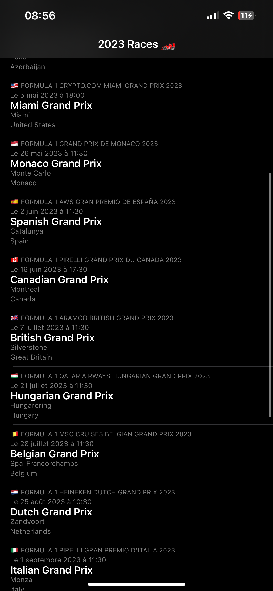
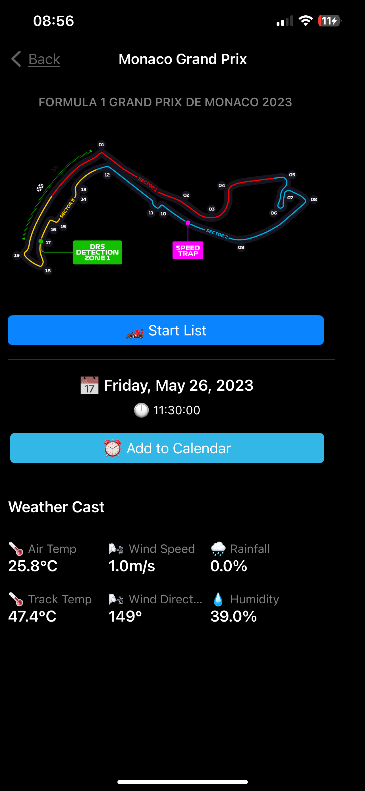
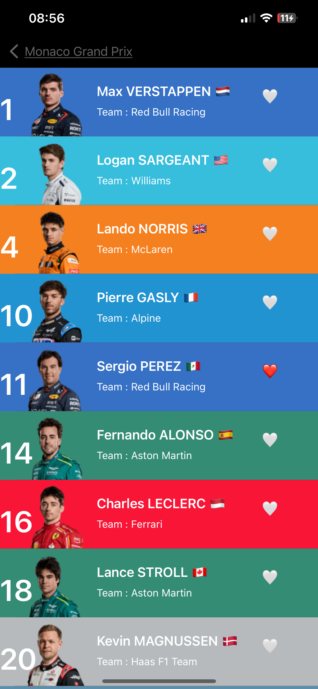
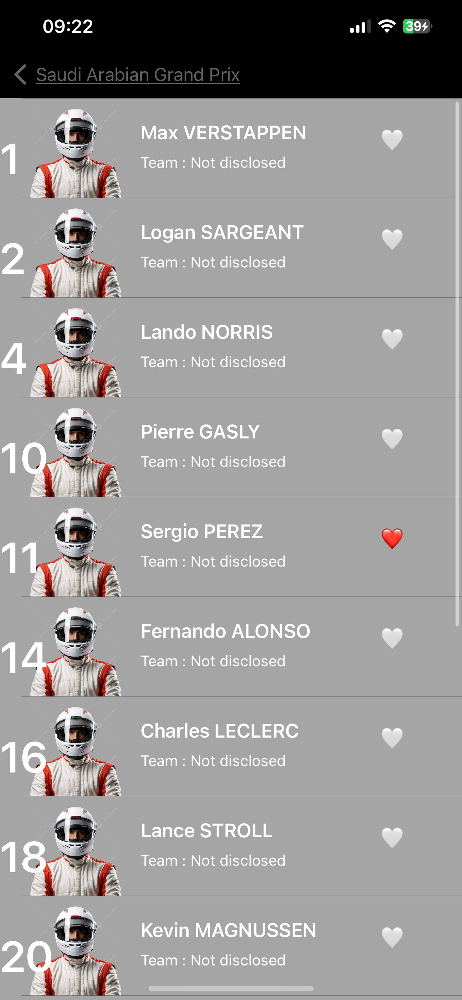

#  Track Rush Project

## App Description

This project is a sample that use UIKit and Formula One API to make a Formula One Championship Information App.

### Races List of 2023 seaeson

### Description of a selected Race

* All informations from the API
* Add Calendar Button feature add the event to the user calendar
* Weather from the Formula One API

### Start list of the drive from the selected Race

#### In this case we have full informations from API

* Drivers Informations from the Formula One API
* Background color match with driver's team. Information from the API
* Use CoreData to add a driver as Favorite Driver. Heart emoji change color if it's Favorite.

#### In this case we have partial informations from API

* Background color is gray
* Picture will be an anonymous driver

## Featuree

* OpenF1 API with formula one informations : https://openf1.org/
* CoreData for addDriverToFavorite feature
* Try code and storyboard approach in the project